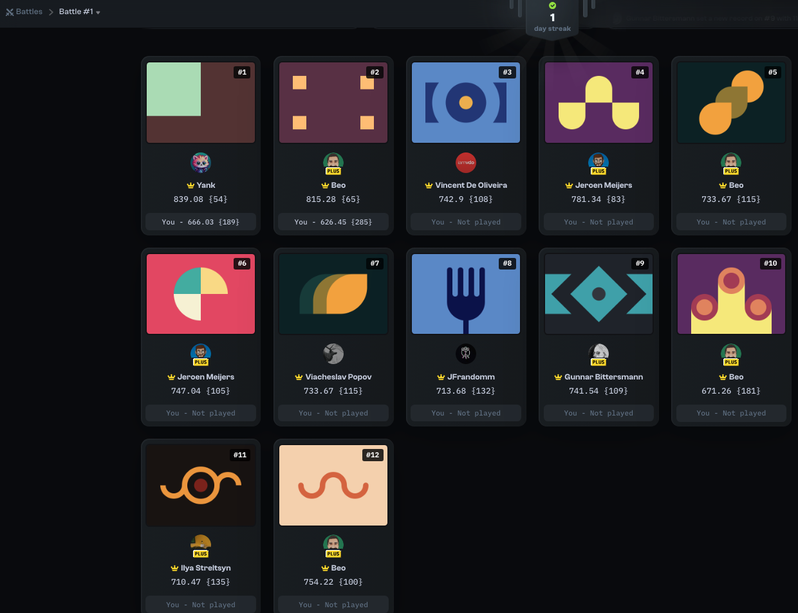

# CSS Battle Challenge Solutions

These are my personal solutions to various CSS Battle challenges. While they might not always be the most optimized, they reflect my unique approach and problem-solving style.

CSS Battle is an excellent platform that has greatly helped me improve my CSS skills through practical exercises. In this page, I’ll be sharing my solutions along with insights into how I tackled each problem.

## Battle #1 - Pilot Battle

[Battle #1 - Pilot Battle Link](https://cssbattle.dev/battle/1)

- [#1 - Simply Square](./solutions/1-pilot-battle/1-simply-square.md)
- [#2 - Carrom](./solutions/1-pilot-battle/2-carrom.md)
- [#3 - Push Button](./solutions/1-pilot-battle/3-push-button.md)
