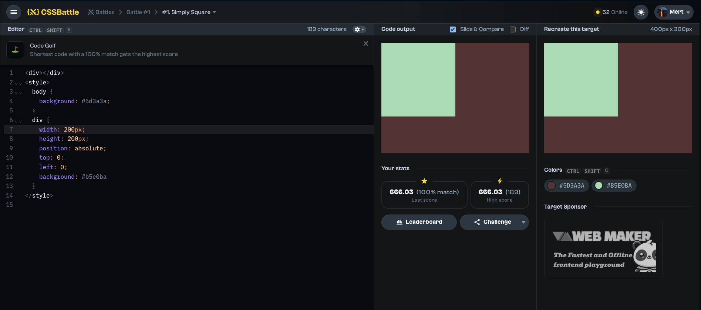

# Battle

## Battle #1

### #1.Simply Square

[1-Simple Square CSS Battle Link](https://cssbattle.dev/play/1)



#### My Solution

```html
<div></div>
<div></div>
<style>
  body {
    background: #5d3a3a;
  }
  div {
    width: 200px;
    height: 200px;
    position: absolute;
    top: 0;
    left: 0;
    background: #b5e0ba;
  }
</style>
```
