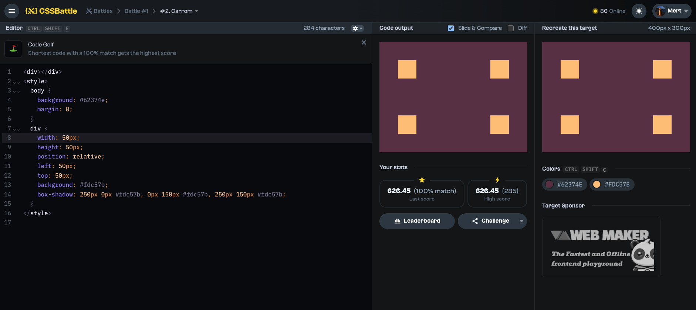

# Battles

## Battle #1

### #2.Carrom

[2-Carrom CSS Battle Link](https://cssbattle.dev/play/1)



#### My Solution

```html
<div></div>
<style>
  body {
    background: #62374e;
    margin: 0;
  }
  div {
    width: 50px;
    height: 50px;
    position: relative;
    left: 50px;
    top: 50px;
    background: #fdc57b;
    box-shadow: 250px 0px #fdc57b, 0px 150px #fdc57b, 250px 150px #fdc57b;
  }
</style>
```
