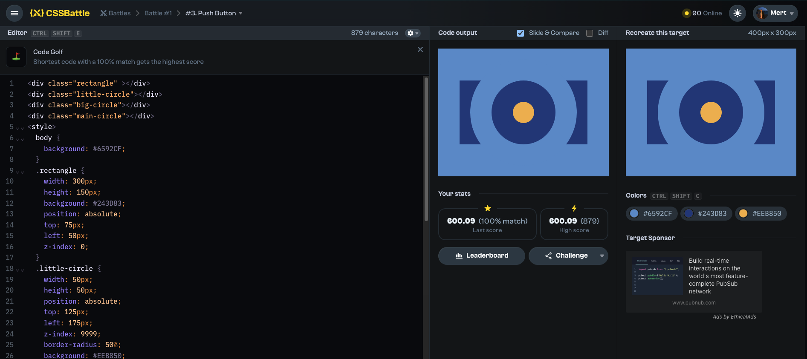

# Battles

## Battle #1

### #3.Push Button

[3-Push Button CSS Battle Link](https://cssbattle.dev/play/3)



#### My Solution

```html
<div class="rectangle"></div>
<div class="little-circle"></div>
<div class="big-circle"></div>
<div class="main-circle"></div>
<style>
  body {
    background: #6592cf;
  }
  .rectangle {
    width: 300px;
    height: 150px;
    background: #243d83;
    position: absolute;
    top: 75px;
    left: 50px;
    z-index: 0;
  }
  .little-circle {
    width: 50px;
    height: 50px;
    position: absolute;
    top: 125px;
    left: 175px;
    z-index: 9999;
    border-radius: 50%;
    background: #eeb850;
  }
  .big-circle {
    width: 250px;
    height: 250px;
    position: absolute;
    top: 25px;
    left: 75px;
    border-radius: 50%;
    background: #6592cf;
    z-index: 2;
  }
  .main-circle {
    width: 150px;
    height: 150px;
    background: #243d83;
    position: absolute;
    top: 75px;
    left: 125px;
    z-index: 999;
    border-radius: 50%;
  }
</style>
```
